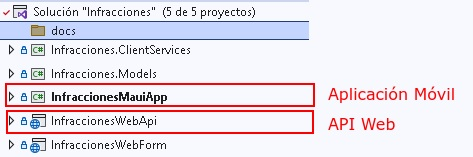

# Aplicación .NET8 (en construcción)

- Aplicación MAUI
- WebAPI

## Solución

<div align="center">
        
        <p>Figura 1. Solución </p>
</div>


## Aplicación móvil

Immplementación del botón
```csharp
        private async void btnPrueba_Clicked(System.Object sender, System.EventArgs e)
        {
            EncuestasService servicio = new InfraccionesService();
            var encuesta = await servicio.Prueba();
            if (encuesta != null)
            {
                lbnRespuesta.Text = encuesta.Nombre;
            }
            else
            {
                lbnRespuesta.Text = "-";
            }
        }
```

## Proyecto - librería de clases- llamada a la API

La llamada de prueba a la API
```csharp
public async Task<Encuesta> Prueba()
{
    string baseUrl = "https://encuesta.somee.com/api/Encuesta/1";

    using (HttpClient httpClient = new HttpClient())
    {
        try
        {
            HttpRequestMessage request = new HttpRequestMessage(HttpMethod.Get, $"{baseUrl}");

            HttpResponseMessage response = await httpClient.SendAsync(request);

            if (response.IsSuccessStatusCode)
            {
                string dataJson = await response.Content.ReadAsStringAsync();

                var encuesta = JsonConvert.DeserializeObject<Encuesta>(dataJson);

                return encuesta;
            }
        }
        catch (Exception ex)
        {
            
        }
    }
    return null;
}
```

## WebAPI
<a href="https://encuesta.somee.com/swagger/index.html">swagger</a> 
